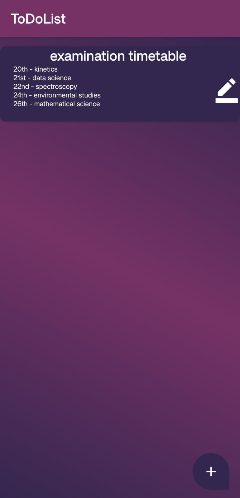
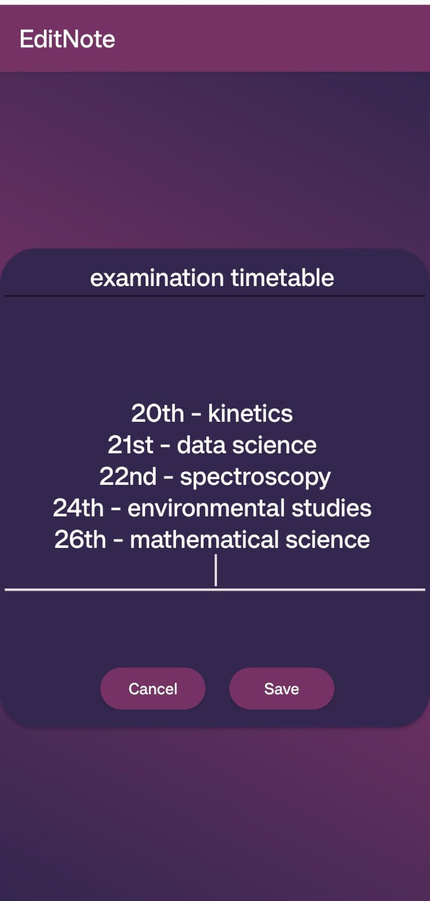

# ToDoList application for Android devices
A convenient application for listing and management of data 

  
## Table of Content 
1. [Features](#features-)
2. [Motivation](#motivation-behind-the-project-)
3. [Local Setup](#local-setup-)
4. [Contributions](#contributions-)

## Features 
- Make limiteless entries into the application with the assurance that no data goes missing 
- Save data into the application in the form of lists
- Have the ability to edit the data saved with the changes being saved later on as well
- Simply delete the junk files by swiping left or right on the selected list

## Motivation
- the ToDoList aplication makes it easier to ensure that all important details are stored at a convenient place for all, whether it be the bucket list of a trip, the topics to be studied for an examination, or simply the timetable for the day, the app can store that all

## Local Setup
-  Fork the repository.
- Clone the forked repository to your local machine.
```markdown
git clone https://github.com/your-username/ToDoList.git
```
- Change the present working directory.
```markdown
cd ToDoList
```
- Install dependencies.
```markdown
npm install
```
- Run the AndroidStudio project
- The project is now running. Congratulations!

## Contribution 
- Contributions to the project are always welcome!

  
